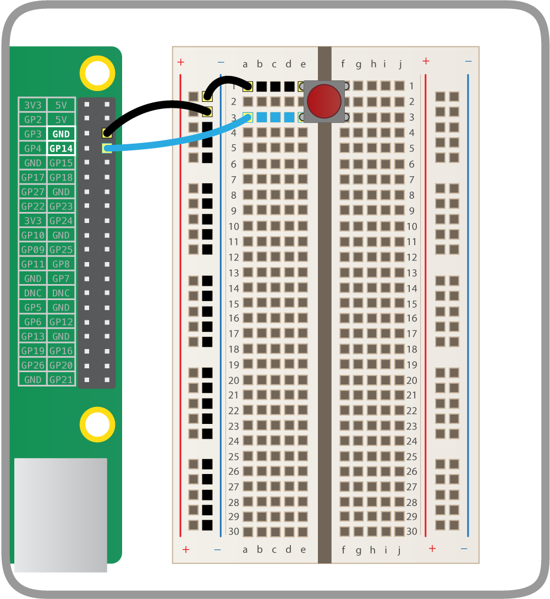
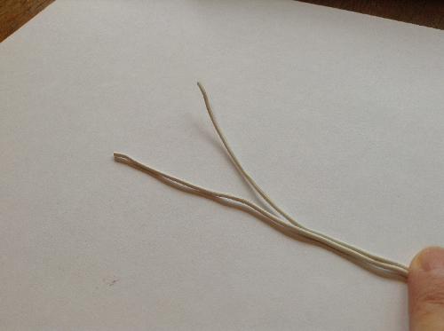
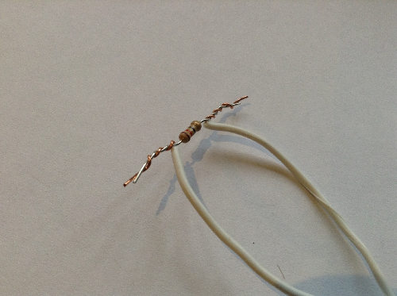
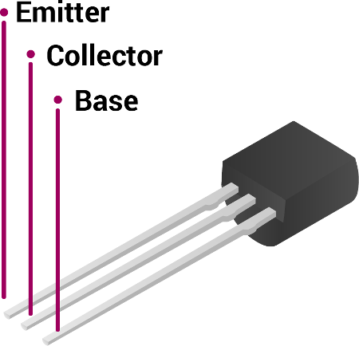
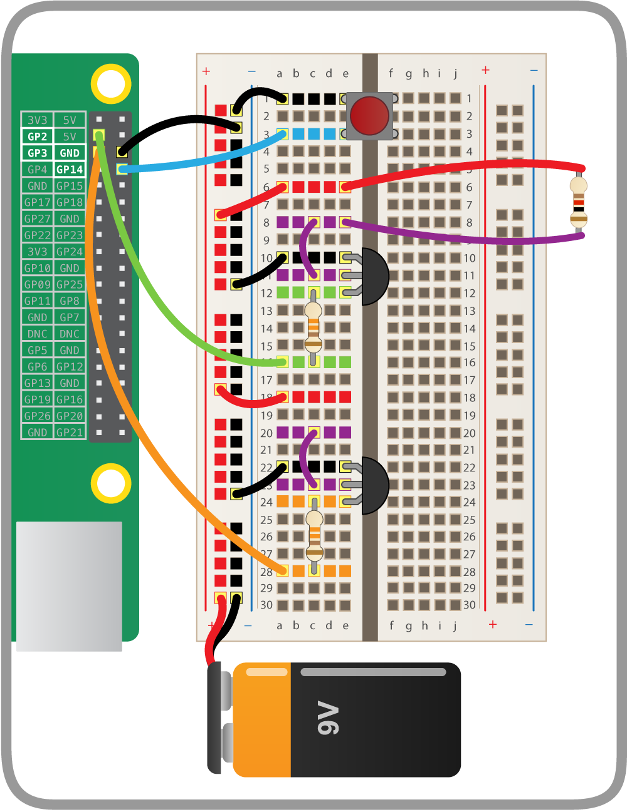

# Balloon Pi-tay popper

To pop balloons you might usually use a pin. Here you'll be doing the same, but using a GPIO pin on your Raspberry Pi, not the pin you might be thinking of!

## Wire up a button

First, we'll wire our push button up to the Raspberry Pi.

1. Take a male-to-female jumper cable and connect the Raspberry Pi's ground pin to the breadboard to make a ground rail:

    

1. Place the push button on the breadboard and connect one of its legs to the ground rail, and one to GPIO pin 14:

    

## Test the button with code

Now we've connected a button, we'll activate it with some Python code.

1. Open IDLE by clicking on **Menu** > **Programming** > **Python 3 (IDLE)** to open a Python shell.

1. In this shell, go to `File -> New File` to open a new Python file.

1. It's good practice to save this file before you type anything important. To save, go to `File -> Save As`, then type in `balloon.py` and click `Save`. Now you can get coding!

1. Start by importing the `gpiozero` library. Write the following line in your Python file:

    ```python
    from gpiozero import Button
    ```

1. Next, leave a new line space to separate your imports from your main code, and add a line to set up a button on pin 14:

    ```python
    button = Button(14)
    ```

1. Now add the following lines:

    ```python
    print("Ready...")
    button.wait_for_press()
    print("Pop!")
    ```

    This will print "Ready", wait for the button to be pressed, and then print "Pop!" which will be the point when our balloon pops later!

1. Save the code with `Ctrl + S` and run with `F5`. When you see `Ready...` on the screen, press the button, and you should see `Pop!` printed to the screen.

## Set up the balloon popper

We're going to be using a resistor to make the balloon pop. Resistors are electrical components which reduce the current flowing around a circuit, and in doing so they sometimes get hot. You're going to be taking advantage of this heat and deliberately overheating a resistor in order to pop a balloon. Before you can do that, though, you need to wire up the resistor:

1. Inflate a balloon so it's nice and full, then tie a knot in it.

1. Take 2 metres of 2-core speaker cable, and strip both ends of both cores so that the bare wire is visible. This can be done with wire strippers or, if you're very careful, with scissors: make sure that you only cut through the insulation and not the wires themselves. You can also split the two cores of the cable a little simply by pulling them apart. At one end of the cable, wrap red electrical tape around one wire (around the insulated section, not the section with the exposed core), and black electrical tape around the other. This is to label them for later.

    

    

1. Take a 12Ω resistor and the ends of the speaker cable without electrical tape around them. Twist one wire of the cable around one wire coming from the resistor, and the other wire around the remaining wire coming from the resistor; it doesn't matter which wire is connected to which.

    Make sure that there's a firm connection; you can even wrap electrical tape around the twisted wire to ensure it stays in place.

    

1. Now, take some more electrical tape (it doesn't matter what colour you use) and tape the resistor firmly onto the most stretched part of the balloon; that's the balloon's side, as in the picture below. It's important that this resistor is firmly touching the balloon, so stick it on carefully.

    

    

1. Now tie some string onto the knot of your balloon and hang it from the ceiling using tape or Blu-Tack.

## Connect the transistor

The voltage of a circuit is the amount of 'push' the current has: a higher voltage provides a bigger push, which usually results in more current flowing in the circuit. Here, in order to make the resistor hot enough to pop the balloon, we need to run a higher current through them than the voltage on the Raspberry Pi can provide, and to do this we'll use a device called a transistor.

A transistor allows you to 'amplify' a circuit, as they can be switched 'on' by a low-voltage circuit, and once 'on' they allow a higher-voltage circuit to flow. However, it's important that they're wired up correctly.

Hold your transistor up and you'll see that it's a semi-circular shape, with three leads coming out the bottom. Each of these leads has a different name and role.

The base controls the transistor and if it receives a signal (a small voltage) it turns the transistor 'on', allowing current from a higher-voltage circuit to flow between the collector and the emitter.

** Please note: some models of transistors have the legs in a different order. If you're not using BC635 transistors then you must look at the datasheet to check that your wiring is correct. Incorrect wiring could damage your Pi or the transistor, or make your balloon pop too early!**

Hold the BC635 transistor with the flat side facing towards you: from left to right the leads are called the emitter, the collector, and the base.



1. Carefully place the transistor onto the breadboard, with the flat side facing the ground rail and a 330Ω resistor connected to the base, like so:

    

    Be sure to place one leg in each hole in the same row.

1. Now connect the top leg of the transistor to the ground rail, and the bottom leg of the 330Ω resistor to GPIO 2 on the Raspberry Pi:

    

## Connect the balloon

Now we're going to use a 9V battery. We need 9 volts for the resistor to get hot enough to pop the balloon!

1. Place the battery in the battery snap. Connect its black lead into the ground rail and the red lead into the power rail on your breadboard - that's the red one adjacent to the ground rail.

    

1. We want this circuit to go through the resistor attached to the balloon. Connect it to the breadboard in the space between the button and the transistor:

    

1. Now connect one side of the resistor to the middle leg of the transistor, and the other side to the 9V power rail:

    

    This circuit is now complete. The current will flow from the battery, through the resistor to the collector leg of the transistor, out the emitter leg and then back to ground. As the current flows through the resistor, it will heat it up so much that the balloon will pop.

## Add the balloon to the code

Now we've completed our circuit we'll need to change our code to trigger the transistor, allowing current to flow through the resistor, which will pop the balloon.

1. First, you're going to need an `OutputDevice` to trigger the transistor, and you'll need the `sleep` method from the `time` library:

    ```python
	from gpiozero import Button, OutputDevice
	from time import sleep
	```

1. Where you previously declared `button = 14`, add a line to declare `balloon = 2`:

    ```python
    button = Button(14)
    balloon = OutputDevice(2)
    ```

   This will designate GPIO pin 2 as what we'll use to pop the balloon.

1. Now comes the code to pop the balloon. Earlier, we used `button.wait_for_press()` to wait for a button press, then we just printed `Pop!`. Add a new line before the `Pop!` line:

    ```python
    balloon.on()
    sleep(10)
    balloon.off()
    ```

    This means "Turn the balloon pin on for 10 seconds, then turn it off".
    
    Depending on the thickness of your balloon and how much it has been blown up and stretched, this may take five seconds or more. If your balloon pops too quickly, you can reduce the length of time accordingly.

1. Now save your code with `Ctrl + S`, check everything's wired up as it should be, then run your code with `F5`. When you see `Ready...`, press the button and your balloon should burst!

## Set up more balloons

Popping one balloon is good, but popping more balloons is so much better! For each extra balloon you'll need another transistor, another resistor, three male-to-male jumpers, one male-to-female jumper, and space on your breadboard.

1. Set up the first balloon as before, replacing the old resistor (it's now burned out!). Leave the rest of the cabling as it is.

1. Set up a second balloon with another resistor.

1. Add your second transistor to the breadboard and wire it up in the same way as before. Connect the inside leg to the ground rail and its outside leg to GPIO pin 3 through a 330Ω resistor (leave the middle leg for now):

    

1. Now connect the second transistor to the second balloon's resistor:

    

    That's it for the wiring, but you can add more balloons if you like!

## Code more balloons

Now we'll return to the code and make a few small adjustments to make it pop more balloons!

1. Where we previously used `balloon = OutputDevice(2)` to store the GPIO pin for the first balloon, you'll now need to set up more balloons. You can do this using a list:

    ```python
	balloons = [OutputDevice(2), OutputDevice(3)]
    ```

1. Then, instead of just popping one balloon, we'll make it pop them all in turn:

    ```python
    for balloon in balloons:
        print("Armed...")
		balloon.on()
        sleep(10)
		balloon.off()
    ```

## What next?

Other stuff to try:

- Try changing the balloons' popping order. To do this, just change the order in which the GPIO pin numbers are used.

- Why not try to have the balloons pop when a motion sensor is triggered? You can find out how to use a motion sensor in the [parent detector resource](https://www.raspberrypi.org/learning/parent-detector/).
